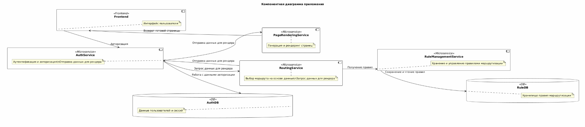
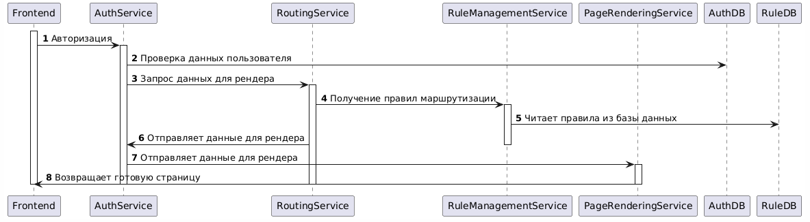

# Описание системы

## Архитектура приложения

### Описание
AuthService — отвечает за аутентификацию и авторизацию пользователей. Этот сервис занимается управлением пользователями и сессиями. Остальные компоненты обращаются к нему для проверки полномочий пользователя при доступе к ресурсам. Также, он выполняет переход на страницу рендеринга PageRenderingService с полученным от RoutingService маршрута

RoutingService — сервис роутинга, определяющий подходящую точку входа для запросов исходя из характеристик устройства, браузера и региона пользователя. Получив информацию о клиентском устройстве и окружении, этот сервис обращается к RuleManagementService, чтобы подобрать подходящее правило маршрутизации.

RuleManagementService — управляет правилами маршрутизации. Предоставляет правила для Роутера (RoutingService) на основе настроек и критериев. Например, основываясь на правилах, определяется, куда перенаправить пользователя (страницу, контент и т.д.).

PageRenderingService — обслуживает динамическую генерацию страниц и визуализацию. Основываясь на маршрутах, выбранных RoutingService, этот сервис собирает нужные ресурсы и рендерит веб-страницы для клиентов.

### Диаграмма компонентов

## Последовательность работы

Поток взаимодействия:

Пользователь авторизуется в систему →

Запрос поступает в RoutingService, который анализирует параметры клиента (устройство, браузер, регион) →

RoutingService связывается с RuleManagementService, чтобы получить подходящий маршрут →

Получив маршрут, RoutingService передает маршрут для рендеринга в AuthService →

AuthService направляет запрос в PageRenderingService →

PageRenderingService собирает необходимые данные и генерирует финальную страницу для пользователя →

Авторизация и контроль доступа осуществляется через AuthService, гарантируя, что доступ предоставляется только пользователям с соответствующими правами.

### Диаграмма последовательности

# Сложности и их решения

Проект представляет собой распределённую систему, состоящую из множества независимых микросервисов, что добавляет сложности в разработку, эксплуатацию и поддержку приложения. 

Вот основные трудности и возможные способы их преодоления:

1. Распределённость приложений

   Микросервисы работают изолированно, расположены в разных контейнерах или хостах, что усложняет отслеживание зависимостей и координации взаимодействия между службами.

    Решение:
    
    - API Gateway: централизованный шлюз для контроля обращений к сервисам, балансировки нагрузки и защиты от несанкционированного доступа.

    - Мониторинг и трассировка: внедрение решений вроде Zipkin или Jaeger для мониторинга транзакций и выявления узких мест.

    - Управление консистентностью: обеспечение атомарной целостности данных через механизм двухфазного коммита или паттерн Saga.

2. Асинхронность и координация между сервисами
   Некоторые процессы в системе асинхронны и зависят от очередей сообщений или событий. Сложность может заключаться в синхронизации и управлении параллельными операциями.

    Решение:
    - Event-driven architecture: переход на событийно управляемую архитектуру с использованием брокеров сообщений (Kafka, RabbitMQ).
    - Use retries and timeouts: реализация механизмов повторных попыток и таймаутов для предотвращения зависших состояний.
   

3. Множество точек отказа

   Каждый микросервис — отдельная точка отказа.

    Решение:
    - Circuit Breaker: введение механизма автоматического отключения неисправных соединений, чтобы предотвратить каскадные отказы.
    - Resilience patterns: использование Resilience4J или Hystrix для изоляции зависимостей и ограничения влияния сбоя одного сервиса на остальные.
    - Защита от DoS/DDoS атак: ограничение скорости запросов и внедрение токенов лимитирования.
   
4. Безопасность

    Каждая служба потенциально уязвима для атак, особенно когда дело касается хранения чувствительных данных и авторизационных токенов.

    Решение:
    - Шифрование каналов передачи: использование TLS/SSL для шифрования трафика между серверами.
    - OAuth2/OpenID Connect: централизованная система аутентификации и авторизации с возможностью делегированного доступа.
    - RBAC (Role-Based Access Control): ограничение доступа пользователей и ролей к различным ресурсам и операциям.
   
5. Совместимость и миграция данных

    Каждое изменение в одном микросервисе может повлиять на другие. Согласованность данных между сервисами — важная проблема, особенно при миграции схем данных.

    Решение:
    - Контрактные тесты: внедрение автоматизированных контрактов (Pact, Consumer Driven Contracts) для проверки совместимости API.
    - Canary Releases: постепенное развертывание обновлений для ограниченного круга пользователей с мониторингом последствий.
    - Schema evolution: поддержка обратной совместимости данных через механизмы расширения схем (автоматическая миграционная логика, soft deletes, etc.)
   
6. Масштабируемость и производительность
   
    Рост объема данных и интенсивности запросов может привести к ухудшению производительности всей системы.

    Решение:
    - Кэширование: использование Redis или Memcached для снижения нагрузки на базу данных.
    - Load balancing: распределение нагрузки через Kubernetes, Docker Swarm или специализированные балансировщики (HAProxy, Nginx).
    - Оптимизация базы данных: вертикальное масштабирование (шардинг, индексация, денормализация таблиц).
   
7. Мониторинг и диагностика
 
    Многочисленность сервисов затрудняет диагностику и устранение ошибок.

    Решение:
    - Централизованное ведение журналов: использование ELK Stack (Elasticsearch, Logstash, Kibana) или Prometheus/Grafana для сбора и анализа логов.
    - Метрики и алерты: интеграция Grafana, Prometheus, Alertmanager для своевременного обнаружения аномалий.
    - Автоматическое восстановление: настройка self-healing через контейнерные оркестраторы (Kubernetes, Nomad).

   
## Резюме
Проект обладает сложной структурой и множеством потенциальных рисков, связанных с распределенностью, безопасностью, производительностью и масштабом. 

Регулярное проведение нагрузочного тестирования, соблюдение стандартов безопасности, внедрение механизмов устойчивости и мониторинга помогут снизить риски и обеспечить надежную работу системы.

# Соответствие критериям приемки

Критерии приемки и обоснование:
1. Покрытие тестами не менее 90%

    - Покрытие тестами достигается благодаря применению инструментария JaCoCo (который "почти" работает =) и наличию набора юнит/интеграционных/функциональных тестов. 
    - Тестами покрыты почти все ветви кода. Из-за непонятного багла, jacoco не считает процент покрытых тестов. Разбираюсь с этим.  
   
2. Расширение функционала без изменения кода

   - Это обеспечивается принципом открытости-закрытости (OCP), применяемым в дизайне системы. Новые модули и функциональность внедряются через инверсию зависимостей. 
   
3. Реализовано не менее 2 единиц требований
   - Разработано несколько функциональностей, каждая из которых соответствует отдельным требованиям бизнеса. Например, маршрутизация запросов и управление правилами, динамическая генерация страниц и авторизация — все это единицы требований, каждая из которых функционирует автономно и реализуется отдельными сервисами.

4. Middleware или аналог
   - Приложение построено на микросервисной архитектуре, где каждый сервис выполняет определенную функцию и коммуницирует с другими сервисами через API-шлюзы (middleware). Сервисы общаются друг с другом асинхронно или синхронно, что уменьшает сложность интеграции и увеличивает устойчивость к сбоям.

5. Динамические плагины или DSL
   - Данный пункт не реализован.

6. Использование IoC (Inversion of Control):
   Да, вся система основана на принципах IoC. Это выражается в:

    - Явное разрешение зависимостей (6.1): мы активно используем dependency injection (DI) через Autowired/Spring, что устраняет необходимость жестко прописывать зависимости.
    - Dependency Injection (6.2): все сервисы и репозитории инъектируются автоматически, что существенно облегчает конфигурирование и тестирование.
   
7. Реализованы микросервисы:
   Да, система разделена на независимые микросервисы, каждый из которых исполняет свою роль:

   - Отдельные приложения (7.1): каждый сервис развёрнут как отдельное приложение.
   - Docker/Kubernetes (7.2): в процессе =)
   
8. Использованы паттерны (кроме Command, Factory, Adapter)

    - Strategy: реализована логика выбора маршрута в зависимости от устройства, браузера и региона.
    - Singleton: одиночные экземпляры для обеспечения глобальных объектов (например, сервисы в Spring).
   
9. Описаны проблемы сложности, характерные для проекта и способы их решения
    Сделано.